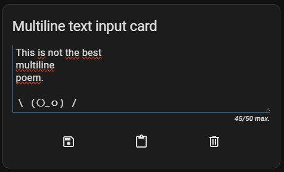
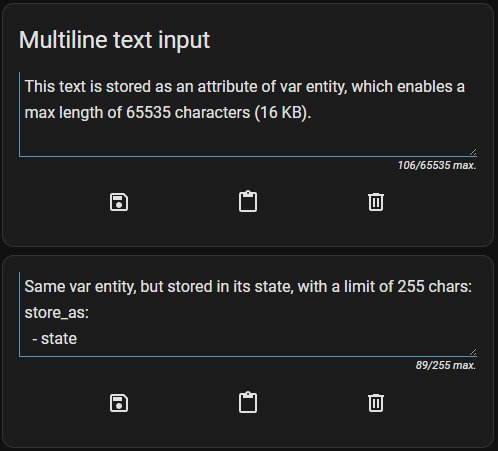
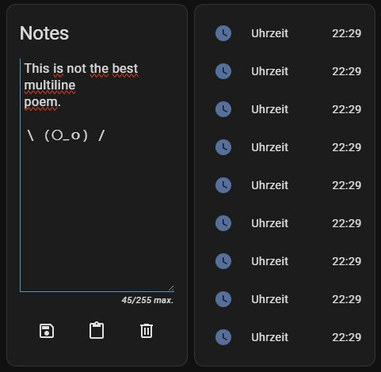
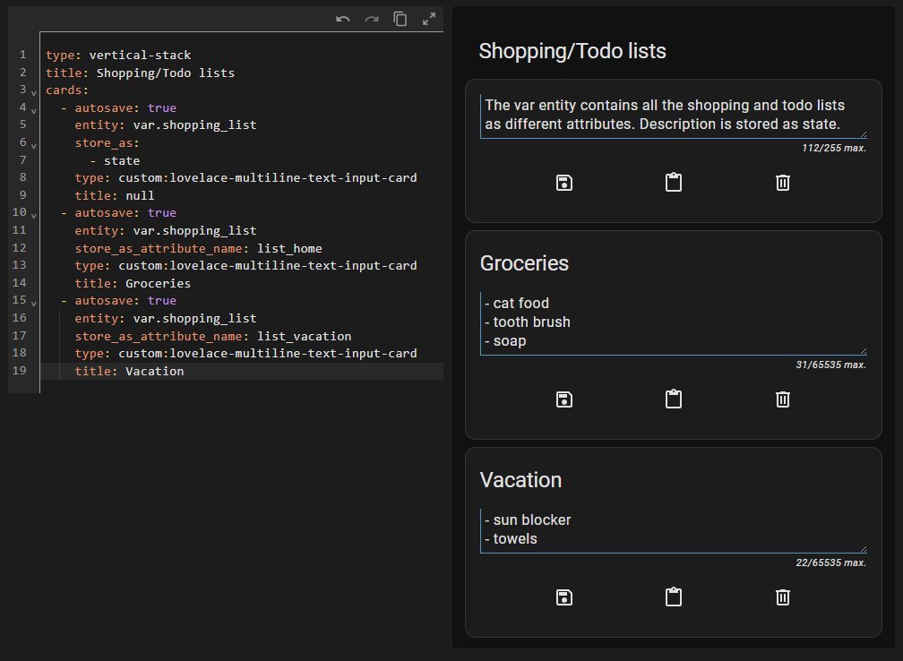

# multiline-text-input-card

This is a simple lovelace card to display a multiline text input field bound on an `input_text` or snarky-snark's `var` [component](https://github.com/snarky-snark/home-assistant-variables/) entity.

However, the `var` [component](https://github.com/snarky-snark/home-assistant-variables/) is recommended to use since Home Assistant limits entity states to a maximum of only 255 characters, while `var` allows us to use attributes with a **limit of 65535 characters (16 KB)** *each* instead. At this point I will not forget to mention that this great component is capable of so much more - have a look at it!

**Since version 1.0.6 you can not only store the content to the state of the specified entity, but also, if using the `var` component, to its attributes. Now it's possible to use *only one entity to store a lot of independent data* by defining multiple instances of the card each targetting different attributes of the same `var` entity (defined by `store_as_attribute_name`).**

Maybe you would like to have a short main container of the contents, you can still use the `state` even if you're using a `var` entity, therefore limited to 255 characters. Then you would like to have another two card instances, each allowing up to 16 KB data independently stored in different attributes. Have a look at the [example vertical-stack configuration](#example-vertical-stack-using-one-var-entity-for-multiple-cards)!


Plus, I borrowed some code and inspiration from [benct's](https://github.com/benct) awesome [Xiaomi Vacuum Card](https://github.com/benct/lovelace-xiaomi-vacuum-card) - many thanks for that one, Ben!


[](https://github.com/faeibson/lovelace-multiline-text-input-card/releases)


[](https://github.com/hacs/integration)



*Default appearance with save, paste and clear buttons, and a max_length of 50.*




*Two card instances, the upper one saves the content as an entity attribute which enables you to store up to 65535 characters (16 KB), whereas the lower card is configured to write the text to the entity's state which has a limit of 255 characters.*


*Appearance of the min_length behaviour. The save button is highlighted and disabled (as is the autosave function).*




*If necessary, the card will stretch to fit the available space, overriding the `min_lines_displayed` setting.*




*Multiple cards using the same `var` entity with different attribute names - check out the [example card configuration](#example-vertical-stack-using-one-var-entity-for-multiple-cards)!*

## Setup

Download [lovelace-multiline-text-input-card.js](lovelace-multiline-text-input-card.js)
to `/www/lovelace-multiline-text-input-card/` folder and add the following lines to the `resources` section in your `ui-lovelace.yaml` file:
```yaml
resources:
  - url: /local/lovelace-multiline-text-input-card/lovelace-multiline-text-input-card.js
    type: module
```

OR install using [HACS](https://hacs.xyz/) and add this instead:
```yaml
resources:
  - url: /hacsfiles/lovelace-multiline-text-input-card/lovelace-multiline-text-input-card.js
    type: module
```

## Options

| Name | Type | Default | Description
| ---- | ---- | ------- | -----------
| type | string | **Required** | `custom:lovelace-multiline-text-input-card`
| entity | string | **Required** | An `input_text` or `var` entity
| autosave | bool | `false` | Save changed content automatically after `autosave_delay_seconds`
| autosave_delay_seconds | int | 1 | Wait `n` seconds after input to trigger the autosave
| buttons | object/bool | [*(see below)*](#buttons-object) | Set to `false` to hide button row
| display_action_results | bool | `true` | Displays the result of executed actions, e.g. saving (previously named as `show_success_messages`, which is still supported)
| icons | object | [*(see below)*](#icons-object) | Set custom button icons (same keys as `buttons` object)
| initial_value | string | | Defines the initial content if no value is set to the specified entity's state or attribute
| max_length | int | `65535` | The maximum text length to be allowed (*)
| min_length | int | `0` | The minimum text length required to be saved to the entity
| min_lines_displayed | int | `2` | Determines the text field's minimal displayed height (lines/rows) even if it has less content
| placeholder_text | string | | Placeholder text to be displayed when empty
| save_on_clear | bool | `false` | Save empty text after pressing the clear button (no effect along with `min_length`)
| store_as | Array | `[ 'attribute' ]` for `var` entities<br>`[ 'state' ]` for `input_text`  | Choose between `attribute` or `state` or both to store the content
| store_as_attribute_name | string | `multiline_text_input` | If the card stores contents as entity attribute, specify the desired attribute name. This also means you can store to different attributes of the same entity by using multiple instances of the card, with different `store_as_attribute_name` values
| title | string | *friendly_name* | The card title - if undefined, falls back to the entity's `friendly_name` attribute. If set to nothing / null (`"title: "` or `"title: null"`), the card header will not be displayed at all

(*) Note: The maximum possible `max_length` depends on the configured `store_as` option, which itself depends on the specified `entity`. If you opt to use a `var` entity, the `store_as` will default to `attribute` which then sets max_length per default to its 65535 characters limit, whereas a standard `input_text` only allows to store contents as state, which then is also the only allowed option for `store_as`. If `store_as` contains the `state` option you will always have to deal with its 255 characters limit.

### Buttons object

| Name | Type | Default | Description
| ---- | ---- | ------- | -----------
| save | int/bool | `1` | Show or hide save button
| paste | int/bool | `2` | Show or hide clipboard paste button (*)
| clear | int/bool | `3` | Show or hide clear button

You can now arrange buttons by giving them indices, beginning from the left. True/false still works as a value, keeping the default arrangement save / paste / clear.

(*) Note: Clipboard paste does not work in all browsers and in most cases requires the user to grant permission first!

### Icons object

| Name | Type | Default | Description
| ---- | ---- | ------- | -----------
| save | string | `mdi:content-save-outline` | Save button icon
| paste | string | `mdi:content-paste` | Paste button icon
| clear | string | `mdi:trash-can-outline` | Clear button icon

## Examples

**Don't forget to define your `input_text` or `var` entity in your `configuration.yaml` first! ;)**

### Simple config example
```yaml
- type: custom:lovelace-multiline-text-input-card
  entity: input_text.input_text_entity
```

With the simplest configuration applied, content limits solely depend on the entity (max length of 255 characters for `input_text`, 65535 for `var`). Default appearance with three buttons for save, paste and clear and their respective icons. The card title will be the entity's *friendly_name* attribute. Autosave is turned off, as is the save-on-clear.

### Advanced configuration
```yaml
- type: custom:lovelace-multiline-text-input-card
  autosave: true
  entity: var.notes
  max_length: 50000
  min_length: 10
  min_lines_displayed: 2
  placeholder_text: 'Text entered here is going to be saved automatically when between 10 and 50000 characters length.'
  show_success_messages: false
  store_as:
    - attribute
  store_as_attribute_name: notes_1
  title: 
  buttons:
    clear: 1
    paste: 2
    save: false
  icons:
    clear: mdi:other-icon
```

- the card's target entity is `var.notes` which enables us to store content as an attribute, allowing up to 16 KB (65535 characters).
- note that `store_as` is only included in this example for clarity, as for `var` entities it will default to `attribute` anyway. You can also add `state`, so that the content will be stored to both attribute as well as state, but this will result in a maximum of 255 characters content.
- the target attribute name is `notes_1` which can later be altered, or in another instance of the card be a different attribute. Note that each individual attribute allows up to 16 KB (65535 characters) content.
- the `min_length` and `max_length` behaviour of the entity will be overwritten. That means, the allowed text length range can be narrowed down, but of course not increased.
- The card title is set manually to nothing, i.e. will not be displayed.
- The text field will always be displayed with a minimum of two lines height (which is the default value anyway).
- The save button will not be shown in favour of the enabled autosave function, and the clear button will appear on the left with the paste button on the right.
- Last but not least, the icon of the clear button will be changed to `mdi:other-icon`.

### Example vertical stack using one `var` entity for multiple cards

```yaml
type: vertical-stack
title: Shopping/Todo lists
cards:
  - autosave: true
    entity: var.shopping_list
    store_as:
      - state
    type: custom:lovelace-multiline-text-input-card
    title: null
  - autosave: true
    entity: var.shopping_list
    store_as_attribute_name: list_home
    type: custom:lovelace-multiline-text-input-card
    title: Groceries
  - autosave: true
    entity: var.shopping_list
    store_as_attribute_name: list_vacation
    type: custom:lovelace-multiline-text-input-card
    title: Vacation
```

